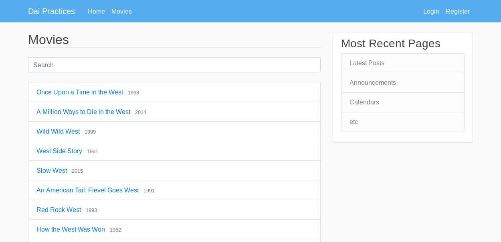

# Prácticas con Python y Flask

## Descripción del proyecto

Este repositorio está destinado a la subida de la práctica de la asignatura Desarrollo de Aplicaciones en Internet.

Aquí se puede encontrar un contenedor Docker destinado a ejecutar el servidor de la página web creada.

En esta práctica se solicitaba la creación de unos formularios para acceder y registrarse en la web, utilizando **pickleshare**  para guardar a los usuarios (NO RECOMENDABLE, ES SOLO UNA PRÁCTICA PARA VER SU FUNCIONAMIENTO).

Para los formularios he creado un archivo [forms.py](./flask/forms.py) con las funciones que he usado. Además he añadido comprobaciones para la inclusión de datos en los campos, como medida de seguridad para no poder crear un mismo usuario dos veces.

Como segundo objetivo se solicitaba el uso de **pymongo** para el manejo de una base de datos cumpliendo las siguientes tareas: mostrarla en la web y tener la capacidad de añadir, modificar o eliminar. En mi caso escogí la de películas, y le implementé una barra de búsqueda con Javascript. Para poder realizar algunas operaciones es necesario iniciar sesión.

A continuación adjunto una captura de como se ve la web:



Si haces click en cualquier pelicula os redirige a su página en [IMDB](https://www.imdb.com), ya que en la base de datos viene el código de la película.

## ¿Cómo lo hago funcionar en mi máquina?

Para ello tienes que hacer un clon del repositorio en tu equipo y disponer de [Docker](https://docs.docker.com/install/) y [Docker Compose](https://docs.docker.com/compose/install/).

Una vez cumplidos los requisitos anteriores ejecutas
```
docker-compose build
docker-compose up
```
Ahora tendras el contenedor corriendo en tu máquina y si accedes a [localhost:8080](localhost:8080) verás la web. Pero aquí no termina todo, ya que aun no se ha cargado la base de datos, por lo que en **Movies** no se verá nada. Entonces hay que ejecutar en una terminal lo siguiente con el servidor levantado:
```
docker-compose exec mongo /bin/bash
mongorestore --drop dump
```
Tras esto podremos verlo tal cual como se muestra en la captura anterior.
